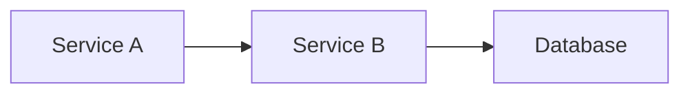

# Implementation Guide: Tightening & Scaling the Skill System

**Date:** 2026-06-26  
**Author:** Claude Code Review  
**Objective:** Implement operational tightness, streamline skill addition/update workflows, and provide a how-to guide for new projects

---

## TABLE OF CONTENTS
1. [Overview & Roadmap](#overview--roadmap)
2. [Part 1: Building the Infrastructure](#part-1-building-the-infrastructure)
3. [Part 2: Skill Addition & Update Process](#part-2-skill-addition--update-process)
4. [Part 3: How-To Guide for New Projects](#part-3-how-to-guide-for-new-projects)

---

## OVERVIEW & ROADMAP

This guide implements **three layers** of operational efficiency:

| Layer | What | Why | Timeline |
|-------|------|-----|----------|
| **Infrastructure** | Validation script, maintenance guide, lookup index | Prevents silent failures, clarifies versioning, enables O(1) skill lookups | Week 1 |
| **Skill Workflow** | Addition checklist, update SOP, testing pattern | Makes adding/updating skills repeatable and low-risk | Week 1 |
| **New Project Setup** | Project template, CLAUDE.md + AGENTS.md patterns, efficiency checklist | Ensures every new repo inherits the skill system without friction | Ongoing |

---

# PART 1: BUILDING THE INFRASTRUCTURE

## 1.1 Validation Script: `validate-skills.py`

**Location:** `~/.agents/validate-skills.py`  
**Purpose:** Prevents silent failures where pipelines reference missing skills/templates.  
**Run:** Before major dispatcher changes, after skill updates, or as a pre-commit hook.

**Implementation:**

```python
#!/usr/bin/env python3
"""
Validate skill manifest integrity against dispatcher pipelines and templates.

Usage:
    python validate-skills.py              # Check all
    python validate-skills.py --fix        # Fix auto-fixable errors
    python validate-skills.py --strict     # Fail on warnings, not just errors
"""
import json
import yaml
import sys
from pathlib import Path
from typing import List, Tuple
import argparse

# Paths
AGENTS_HOME = Path.home() / ".agents"
MANIFEST_PATH = AGENTS_HOME / ".skills_manifest.json"
DISPATCHER_PATH = AGENTS_HOME / "dispatcher.yaml"
TEMPLATES_DIR = AGENTS_HOME / "templates"
SKILLS_DIR = AGENTS_HOME / "skills"
LOOKUP_INDEX_PATH = AGENTS_HOME / ".skills_lookup_index.json"

# Color output
RED = "\033[91m"
GREEN = "\033[92m"
YELLOW = "\033[93m"
BLUE = "\033[94m"
RESET = "\033[0m"

class SkillValidator:
    def __init__(self, strict=False):
        self.strict = strict
        self.errors = []
        self.warnings = []
        self.manifest = {}
        self.dispatcher = {}
        self.load_configs()

    def load_configs(self):
        """Load manifest and dispatcher configs."""
        if not MANIFEST_PATH.exists():
            self.errors.append(f"Manifest not found: {MANIFEST_PATH}")
            return
        if not DISPATCHER_PATH.exists():
            self.errors.append(f"Dispatcher not found: {DISPATCHER_PATH}")
            return

        with open(MANIFEST_PATH) as f:
            self.manifest = json.load(f)
        with open(DISPATCHER_PATH) as f:
            self.dispatcher = yaml.safe_load(f)

    def validate_skill_exists(self, skill_name: str) -> bool:
        """Check if skill SKILL.md file exists."""
        skill_path = SKILLS_DIR / skill_name / "SKILL.md"
        return skill_path.exists()

    def validate_template_exists(self, template_name: str) -> bool:
        """Check if template file exists."""
        template_path = TEMPLATES_DIR / template_name
        return template_path.exists()

    def validate_dependency_chain(self, chain: str) -> List[str]:
        """Parse and validate a dependency chain."""
        if not chain:
            return []
        skills = [s.strip() for s in chain.split("->")]
        missing = [s for s in skills if not self.validate_skill_exists(s)]
        return missing

    def check_manifest_integrity(self):
        """Validate each skill in manifest."""
        print(f"\n{BLUE}[1] Checking manifest integrity...{RESET}")
        for skill_name, skill_config in self.manifest.items():
            # Check SKILL.md exists
            if not self.validate_skill_exists(skill_name):
                self.errors.append(
                    f"Skill '{skill_name}' in manifest but SKILL.md missing"
                )

            # Check dependency chains
            chain = skill_config.get("composition", {}).get("dependency_chain", "")
            if chain and (missing := self.validate_dependency_chain(chain)):
                self.errors.append(
                    f"{skill_name}: dependency chain broken — missing {missing}"
                )

            # Check templates
            for template in skill_config.get("artifacts", {}).get(
                "preferred_templates", []
            ):
                if not self.validate_template_exists(template):
                    self.errors.append(
                        f"{skill_name}: preferred template '{template}' missing"
                    )

            # Check adopted_status is one of valid values
            adopted_status = skill_config.get("meta", {}).get("adopted_status")
            if adopted_status and adopted_status not in [
                "active",
                "maintained",
                "deprecated",
            ]:
                self.warnings.append(
                    f"{skill_name}: adopted_status '{adopted_status}' not in "
                    "[active, maintained, deprecated]"
                )

    def check_dispatcher_integrity(self):
        """Validate dispatcher pipelines reference valid skills."""
        print(f"{BLUE}[2] Checking dispatcher pipelines...{RESET}")
        for pipeline_name, pipeline in self.dispatcher.get("intent_pipelines", {}).items():
            for step in pipeline.get("sequence", []):
                skill = step.get("skill")
                step_num = step.get("step")

                if skill not in self.manifest:
                    self.errors.append(
                        f"Pipeline '{pipeline_name}' step {step_num}: skill '{skill}' not in manifest"
                    )

                template = step.get("template")
                if template and not self.validate_template_exists(template):
                    self.errors.append(
                        f"Pipeline '{pipeline_name}' step {step_num}: template '{template}' missing"
                    )

                # Check companion skills exist
                companion = step.get("companion")
                if companion and companion not in self.manifest:
                    self.errors.append(
                        f"Pipeline '{pipeline_name}' step {step_num}: companion skill '{companion}' not in manifest"
                    )

    def check_semantic_trigger_collisions(self):
        """Check for duplicate semantic triggers across skills."""
        print(f"{BLUE}[3] Checking for semantic trigger collisions...{RESET}")
        all_triggers = {}
        for skill_name, skill_config in self.manifest.items():
            for trigger in skill_config.get("routing", {}).get(
                "semantic_triggers", []
            ):
                if trigger in all_triggers:
                    self.warnings.append(
                        f"Semantic trigger '{trigger}' used by both "
                        f"'{all_triggers[trigger]}' and '{skill_name}' — "
                        "prioritize via explicit_triggers"
                    )
                else:
                    all_triggers[trigger] = skill_name

    def validate_adopted_status_consistency(self):
        """Warn if active skills not in pipelines, or maintained skills are in pipelines."""
        print(f"{BLUE}[4] Checking adopted_status consistency...{RESET}")
        active_skills = {
            name
            for name, config in self.manifest.items()
            if config.get("meta", {}).get("adopted_status") == "active"
        }
        skills_in_pipelines = set()
        for pipeline in self.dispatcher.get("intent_pipelines", {}).values():
            for step in pipeline.get("sequence", []):
                skills_in_pipelines.add(step.get("skill"))
                if companion := step.get("companion"):
                    skills_in_pipelines.add(companion)

        # Warn if active skills not used in any pipeline
        unused_active = active_skills - skills_in_pipelines
        if unused_active and self.strict:
            self.warnings.append(
                f"Active skills not in any pipeline: {unused_active} — "
                "consider downgrading to 'maintained'"
            )

    def generate_lookup_index(self) -> bool:
        """Generate .skills_lookup_index.json for O(1) keyword lookup."""
        print(f"{BLUE}[5] Generating lookup index...{RESET}")
        try:
            lookup_index = {}
            for skill_name, skill_config in self.manifest.items():
                triggers = (
                    skill_config.get("routing", {}).get("explicit_triggers", [])
                    + skill_config.get("routing", {}).get("semantic_triggers", [])
                )
                lookup_index[skill_name] = list(set(triggers))  # Dedupe

            with open(LOOKUP_INDEX_PATH, "w") as f:
                json.dump(lookup_index, f, indent=2)
            print(f"  {GREEN}✓ Lookup index written to .skills_lookup_index.json{RESET}")
            return True
        except Exception as e:
            self.errors.append(f"Failed to generate lookup index: {e}")
            return False

    def run(self, generate_index=True) -> bool:
        """Run all validations."""
        print(f"\n{BLUE}{'='*60}")
        print(f"SKILL SYSTEM VALIDATION")
        print(f"{'='*60}{RESET}")

        self.check_manifest_integrity()
        self.check_dispatcher_integrity()
        self.check_semantic_trigger_collisions()
        self.validate_adopted_status_consistency()

        if generate_index:
            self.generate_lookup_index()

        # Report
        print(f"\n{BLUE}{'='*60}")
        print(f"RESULTS")
        print(f"{'='*60}{RESET}")

        if self.errors:
            print(f"\n{RED}ERRORS ({len(self.errors)}){RESET}")
            for err in self.errors:
                print(f"  ❌ {err}")

        if self.warnings:
            print(f"\n{YELLOW}WARNINGS ({len(self.warnings)}){RESET}")
            for warn in self.warnings:
                print(f"  ⚠️  {warn}")

        if not self.errors and not self.warnings:
            print(f"\n{GREEN}✓ All checks passed.{RESET}")
            return True

        if self.errors or (self.warnings and self.strict):
            return False
        return True


if __name__ == "__main__":
    parser = argparse.ArgumentParser(
        description="Validate skill manifest and dispatcher integrity"
    )
    parser.add_argument(
        "--strict",
        action="store_true",
        help="Fail on warnings, not just errors",
    )
    parser.add_argument(
        "--skip-index",
        action="store_true",
        help="Skip generating lookup index",
    )
    args = parser.parse_args()

    validator = SkillValidator(strict=args.strict)
    success = validator.run(generate_index=not args.skip_index)
    sys.exit(0 if success else 1)
```

**Setup:**
```bash
chmod +x ~/.agents/validate-skills.py

# Run manually anytime:
python ~/.agents/validate-skills.py

# Run with strict checking:
python ~/.agents/validate-skills.py --strict

# Add to pre-commit hook (optional):
# In .git/hooks/pre-commit:
# python ~/.agents/validate-skills.py --strict || exit 1
```

---

## 1.2 Skill Maintenance Guide: `SKILL_MAINTENANCE.md`

**Location:** `~/.agents/SKILL_MAINTENANCE.md`  
**Purpose:** Document versioning, deprecation, and trigger updates.

```markdown
# Skill Maintenance & Lifecycle

This document defines how skills evolve, version, and deprecate over time.

## Versioning Scheme

Skills follow **Semantic Versioning** (MAJOR.MINOR.PATCH):

- **MAJOR (x.0.0):** Breaking API change
  - Skill charter or persona fundamentally shifts (e.g., `k8s-gateway-api` transitions from v1 to v2 specs)
  - Companion skills change (existing pipelines may break)
  - Preferred templates change
  - Requires REVIEW.md update and dispatcher.yaml audit
  - Announce in CHANGELOG.md

- **MINOR (x.y.0):** Non-breaking additions
  - New semantic triggers added (doesn't break existing triggers)
  - New companion skills added (old companions still valid)
  - New preferred templates added
  - New workflow steps added
  - Version bump only; no pipeline changes needed

- **PATCH (x.y.z):** Bug fixes and clarifications
  - Typo fixes in SKILL.md
  - Clarification to persona or workflow (no logic change)
  - No versioning requirement; just update the file

**Version Format in Manifest:**
```json
{
  "my-skill": {
    "meta": {
      "name": "My Skill",
      "tier": "Reasoning",
      "version": "1.2.3",
      "adopted_status": "active",
      "last_updated": "2026-06-26"
    }
  }
}
```

## Deprecation Timeline

When a skill is no longer needed:

1. **Phase 1 (T):** Mark as deprecated in manifest
   ```json
   "deprecated": {
     "from_version": "1.5.0",
     "replacement_skill": "new-skill-name",
     "timeline": "2026-09-26",
     "reason": "Replaced by new-skill-name which handles X better"
   }
   ```

2. **Phase 2 (T to T+60 days):** Keep skill available; notify downstream pipelines
   - Remove from any active dispatcher pipelines
   - Update SKILLS_INDEX.md to mark as "Deprecated (removal target: T+60)"
   - Add deprecation note to skill's SKILL.md front matter

3. **Phase 3 (T+60 days):** Archive and remove
   - Move skill directory to `~/.agents/.archive/skills/skill-name-v1.5.0/`
   - Remove from `.skills_manifest.json`
   - Run `validate-skills.py` to confirm no broken references
   - Update CHANGELOG.md

## Updating Semantic Triggers

When a new keyword/phrase should activate a skill:

**Process:**
1. **Identify collision:** Grep `.skills_manifest.json` to ensure trigger isn't already used
   ```bash
   grep -r '"your-new-trigger"' ~/.agents/.skills_manifest.json
   ```

2. **Add to skill's manifest entry:**
   ```json
   "semantic_triggers": [
     "existing-trigger",
     "your-new-trigger"
   ]
   ```

3. **Document in SKILL.md:**
   ```markdown
   ## Semantic Triggers (When user says)
   - "existing phrase"
   - "your new phrase"
   ```

4. **Test:** Run `validate-skills.py` to ensure no collisions
5. **Bump MINOR version** (e.g., 1.2.0 → 1.3.0)

## Updating Companion Skills

When a skill needs new companion skills (e.g., `ai-engineer` now works better with `ai-security-patterns`):

**Process:**
1. **Add to manifest:**
   ```json
   "composition": {
     "primary_for": [...],
     "companion_skills": ["existing-companion", "new-companion"],
     "dependency_chain": "ai-engineer -> new-companion -> docs-agent"
   }
   ```

2. **Document in SKILL.md:**
   ```markdown
   ## Common Compositions
   - Primary: `ai-engineer`
   - Companion 1: `ai-security-patterns` (add safety checks)
   - Companion 2: `docs-agent` (document findings)
   ```

3. **Test:** Run `validate-skills.py`
4. **Bump MINOR or MAJOR version** depending on whether old companion skills still work

## Updating Preferred Templates

When a skill should prefer a new template:

1. **Ensure template exists:** Verify file is in `~/.agents/templates/`
2. **Update manifest:**
   ```json
   "artifacts": {
     "preferred_templates": ["old-template.md", "new-template.md"],
     "output_standard": "Markdown"
   }
   ```

3. **Document in SKILL.md** which template to use when
4. **Bump MINOR version**

## Adding a New Skill

See: [PART 2: Skill Addition & Update Process](#part-2-skill-addition--update-process)

## Quarterly Skill Health Audit

**Schedule:** First Thursday of each quarter (next: Sept 5, Dec 5, Mar 5, Jun 5)

**Checklist:**
- [ ] Run `validate-skills.py --strict`
- [ ] Check for skills with `version < X` (more than 2 major releases old)
  - Consider MAJOR version bump for alignment
- [ ] Audit `adopted_status` values:
  - [ ] "active" skills: verify they appear in `dispatcher.yaml`
  - [ ] "maintained" skills: used in past 6 months? (grep git log)
  - [ ] "deprecated" skills: past removal timeline? Archive them.
- [ ] Regenerate `.skills_lookup_index.json`
- [ ] Update CHANGELOG.md with quarterly summary

## Changelog

**Format:** Keep a `CHANGELOG.md` at `~/.agents/CHANGELOG.md`

```markdown
# Changelog

## [1.0.0] - 2026-06-26
### Added
- Skill validation script (`validate-skills.py`)
- Skill maintenance guide (`SKILL_MAINTENANCE.md`)
- Adopted status tracking in manifest

### Changed
- Updated all skills to include `adopted_status` field

### Deprecated
- `legacy-skill` (use `new-skill` instead) — removal target: 2026-09-26

## [0.9.0] - 2026-06-15
### Added
- Initial skill manifest with 32 skills
```

## REFERENCES
- [[RULES.md]] — Global execution rules
- [[dispatcher.yaml]] — Intent-based pipelines
- [[.skills_manifest.json]] — Skill registry
```

**Create it:**
```bash
cat > ~/.agents/SKILL_MAINTENANCE.md << 'EOF'
[content from above, or copy-paste the template]
EOF
```

---

## 1.3 Update `RULES.md` with Adopted Status

Add this section to `~/.agents/RULES.md`:

```markdown
## 7. Skill Adoption Tiers

Every skill in `.skills_manifest.json` has an `adopted_status` field:

- **active:** Used in one or more dispatcher pipelines. Core to your practice. Prioritized for maintenance.
- **maintained:** Available but not in active pipelines. Maintained for backward compatibility. Low-priority updates.
- **deprecated:** Marked for removal. See SKILL_MAINTENANCE.md for timeline.

### Current Active Skills (Updated Quarterly)
These are the core skills you rely on daily:
- `ai-engineer` (AI PoCs)
- `ai-security-patterns` (GenAI security)
- `k8s-gateway-api` (Kubernetes routing)
- `k8s-gateway-inference` (Model routing)
- `k8s-observability-ops` (Observability)
- `k8s-engineer` (Kubernetes troubleshooting)
- `nginx-patterns` (NGINX optimization)
- `docs-agent` (Technical writing)
- `tech-pm` (Product strategy)
- `prd-generator` (PRD writing)
- `platform-engineer` (Infrastructure)

### Maintained Skills
Available for specialized tasks but not core to active pipelines:
- `google-agents-cli-*` (Google ADK tools) — 7 skills
- `obsidian-*` (Knowledge management) — 3 skills
- `json-canvas` (Obsidian Canvas files)
- `positioning-messaging` (Marketing)
- `slide-deck-creator` (Presentations)
- `python-dev-standard` (Python standards)
- `value-proposition` (JTBD)
- `pm-standards` (PM frameworks)
- `find-skills` (Skill discovery)
- `defuddle` (Web content extraction)

### Deprecation & Archival
Removed skills are archived to `~/.agents/.archive/skills/` with their version.
See SKILL_MAINTENANCE.md for the deprecation timeline.
```

---

## 1.4 Generate Lookup Index: `.skills_lookup_index.json`

**Purpose:** O(1) keyword → skill lookup (faster than grepping manifest).

**Auto-generated by:** `validate-skills.py`

**Manual generation (one-time):**
```bash
python ~/.agents/validate-skills.py
```

**Output format:**
```json
{
  "ai-engineer": ["ai-engineer", "poc", "agentic", "ollama", "langchain", "mcp"],
  "k8s-gateway-api": ["k8s-gateway-api", "gatewayclass", "httproute", "gateway", "kubernetes routing"],
  "nginx-patterns": ["nginx", "sse", "proxy", "streaming", "buffering"],
  ...
}
```

---

## 1.5 Skill Documentation Template: `SKILL.md`

**Location:** `~/.agents/SKILL_TEMPLATE.md`  
**Purpose:** Standardize SKILL.md structure across all 32 skills.

```markdown
---
name: {{skill-name}}
description: {{One-line trigger description for system reminders, max 100 chars}}
---

# PERSONA
[2-3 sentences: your role, mindset, and core competency. Answer: "Who am I and what am I an expert in?"]

## Core Expertise
- {{Domain 1}}
- {{Domain 2}}
- {{Domain 3}}

# TRIGGERS & WHEN TO USE

## Explicit Triggers
- `{{keyword-1}}`
- `{{keyword-2}}`

## Semantic Triggers (When user says)
- "{{phrase that activates this skill}}"
- "{{another phrase}}"

## When NOT to Use
- {{Scenario where this skill should defer to another skill (reference by name)}}
- {{Another scenario}}

# CONSTRAINTS & PERMISSIONS

* [x] EXECUTION: {{What CLI commands/tools this skill can run}}
  - Example: [x] `python`, `pip`, `pytest` but [ ] `kubectl`, `helm`
* [x] FILE EDITING: {{Allowed file types}}
  - Example: [x] `.py`, `.md` but [ ] `.yaml` configs

# CORE COMPETENCY MAP

| Domain | Key Concepts |
|--------|-------------|
| {{Domain 1}} | {{Concept A}}, {{Concept B}} |
| {{Domain 2}} | {{Concept C}}, {{Concept D}} |

# EXECUTION STANDARDS

1. {{Your first principle}} — {{Why this matters}}
2. {{Your second principle}} — {{Why this matters}}
3. {{Your third principle}} — {{Why this matters}}

# WORKFLOW

When activated, follow this sequence:

1. {{Step 1: Understand}} — {{What to analyze or gather}}
2. {{Step 2: Decide}} — {{What decision you're making}}
3. {{Step 3: Execute}} — {{What you're building/writing/configuring}}
4. {{Step 4: Verify}} — {{How you're testing/validating}}

# WHAT TO WATCH FOR (Anti-Patterns)

Flag these proactively if you see them:

- **{{Anti-pattern 1}}** → Fix by {{remedy}}
  - Example: {{Concrete bad example}}
  - Good: {{Concrete good example}}

- **{{Anti-pattern 2}}** → Fix by {{remedy}}
  - Example: {{Concrete bad example}}

# COMMON COMPOSITIONS

This skill often works with:

| Companion | Why | Example Pipeline |
|-----------|-----|------------------|
| {{Skill 1}} | {{When to pair}} | {{Pipeline name}} |
| {{Skill 2}} | {{When to pair}} | {{Pipeline name}} |

# REFERENCES

- Template: [{{Template Name}}](../templates/{{template-file}}.md)
- Workflow: [{{Workflow Name}}](../workflows/{{workflow-file}}.md)
- Dispatcher Pipeline: `dispatcher.yaml` → `{{pipeline-name}}`

# NOTES FOR FUTURE MAINTAINERS

- {{Anything that's not obvious but important for someone updating this skill later}}
```

**Apply to all 32 skills:** This will take ~2-3 hours. Prioritize high-use skills first (ai-engineer, k8s-gateway-api, nginx-patterns, docs-agent).

---

## 1.6 Quick-Start Cheat Sheet: `USAGE.md`

**Location:** `~/.agents/USAGE.md`  
**Purpose:** One-page guide to common skill combinations.

```markdown
# Skill System Quick-Start

Use this cheat sheet to find the right skill combination for your task.

## "I want to deploy an AI inference gateway"

**Skills in order:**
1. `k8s-gateway-api` — Design GatewayClass, HTTPRoute, and traffic splitting
2. `k8s-gateway-inference` — Configure InferencePool and model routing
3. `nginx-patterns` — Optimize proxy buffering, SSE, and upstream retries
4. `k8s-observability-ops` — Add OTEL tracing for inference latency

**Dispatcher Pipeline:** `ai-gateway-deployment`  
**Estimated time:** 3-4 hours  
**Output:** Deployable K8s manifests + NGINX config + OTEL instrumentation

---

## "I want to troubleshoot a broken Kubernetes cluster"

**Skills in order:**
1. `k8s-engineer` — Diagnostic queries (logs, events, describe)
2. `platform-engineer` — Infrastructure/node-level root cause
3. `k8s-engineer` + `platform-engineer` — Implement fix + verify

**Dispatcher Pipeline:** `cluster-troubleshooting`  
**Estimated time:** 1-3 hours (depends on severity)  
**Output:** Remediation + post-mortem documentation

---

## "I want to write a Product Requirements Document (PRD)"

**Skills in order:**
1. `tech-pm` — Capture strategic intent ("What problem are we solving?")
2. `value-proposition` — Build JTBD value map ("What's the job-to-be-done?")
3. `pm-standards` — Run RICE prioritization ("What's the priority?")
4. `prd-generator` — Write full PRD ("What are the requirements?")
5. `slide-deck-creator` — Generate executive slides ("How do we pitch this?")

**Dispatcher Pipeline:** `product-definition`  
**Estimated time:** 2-3 days (depends on scope)  
**Output:** PRD document + slide deck

---

## "I want to build an agentic routing proof-of-concept"

**Skills in order:**
1. `ai-engineer` — Design agentic logic and decision tree
2. `nginx-patterns` + `k8s-gateway-api` — Implement L7 routing (semantic/header-based)
3. `k8s-observability-ops` — Instrument with GenAI semantic convention tracing
4. `docs-agent` — Write ADR and engineer handoff

**Dispatcher Pipeline:** `agentic-routing-poc`  
**Estimated time:** 2-3 weeks (POC → production handoff)  
**Output:** Working agentic router + ADR + tracing dashboards

---

## "I want to provision a new Kubernetes cluster + GitOps bootstrap"

**Skills in order:**
1. `platform-engineer` — Provision cluster (vcluster/k3d/Cloud)
2. `k8s-engineer` — Bootstrap FluxCD/ArgoCD and sync repos
3. `k8s-observability-ops` — Install Prometheus/Grafana/OTel baseline

**Dispatcher Pipeline:** `cluster-lifecycle`  
**Estimated time:** 2-4 hours  
**Output:** Production-ready cluster + GitOps pipelines + monitoring

---

## "I want to add security guardrails to my AI model"

**Skills:**
1. `ai-security-patterns` — Audit LLM surface (prompt injection, PII, jailbreaks)
2. `ai-engineer` — Implement guardrails (input filters, output sanitizers)
3. `docs-agent` — Document security model

**No dispatcher pipeline yet** — request one if this becomes a common task  
**Estimated time:** 1-2 weeks (depends on threat model)  
**Output:** Guardrails code + security architecture doc

---

## How to Find the Right Skill

**Step 1: Describe your task** (e.g., "I want to optimize NGINX for streaming responses")

**Step 2: Grep semantic triggers**
```bash
# Find matching skills
grep -i "streaming\|sse\|buffering" ~/.agents/.skills_manifest.json | jq '.[] | select(.routing.semantic_triggers[] | contains("your-keyword"))'

# Or use the lookup index
python ~/.agents/check-skill.py "streaming"
```

**Step 3: Check dispatcher pipelines**
```bash
# Look for your use case in dispatcher.yaml
grep -A 10 "intent_pipelines:" ~/.agents/dispatcher.yaml | grep -i "your-keyword"
```

**Step 4: Load the skill**
```bash
# You can invoke via the Skill tool or ask Claude Code directly
# Claude Code will automatically detect your intent and load the right skill
```

---

## Composing Multiple Skills

If your task spans multiple domains, combine skills in **dependency order**:

**Example: "I want to build and deploy an AI gateway with security"**

```
ai-engineer (design) → ai-security-patterns (secure it) 
  → k8s-gateway-api (K8s config) 
  → k8s-gateway-inference (model routing) 
  → nginx-patterns (optimize) 
  → k8s-observability-ops (observe)
  → docs-agent (document)
```

**Maximum composition:** 1 primary skill + 2 secondary skills per execution step. For longer chains, use dispatcher pipelines (they handle orchestration).

---

## Advanced: Creating a Custom Dispatcher Pipeline

If you have a common workflow that's not in `dispatcher.yaml`:

1. **Identify the sequence** of skills needed
2. **Test the sequence manually** by loading each skill in order
3. **Document the pipeline** in `dispatcher.yaml`:

```yaml
intent_pipelines:
  your-custom-pipeline:
    description: "Your task description"
    sequence:
      - step: 1
        role: YourRole
        skill: skill-1
        output: "What skill 1 produces"
      - step: 2
        role: YourRole
        skill: skill-2
        companion: skill-1
        output: "What skill 2 produces"
```

4. **Run validation:** `python ~/.agents/validate-skills.py`
5. **Test:** Load the pipeline and verify the output chain

---

## When to Add a New Skill

Add a new skill to `~/.agents/skills/` when you have:

- ✅ A **repeatable, domain-specific process** (e.g., "deploying K8s clusters")
- ✅ **Clear entry criteria** (semantic triggers or explicit keywords)
- ✅ **Clear output format** (what does "done" look like?)
- ✅ **Reusable across multiple projects**

**Do NOT add a skill if:**
- ❌ It's a one-off task (just ask Claude directly)
- ❌ It overlaps significantly with existing skills (extend an existing skill instead)
- ❌ You don't have clear personas/workflows for it yet

See Part 2 below for the skill addition process.
```

**Create it:**
```bash
cat > ~/.agents/USAGE.md << 'EOF'
[content from above]
EOF
```

---

## 1.7 Pre-Commit Hook (Optional)

Add to `.git/hooks/pre-commit` to validate skills before committing:

```bash
#!/bin/bash
# .git/hooks/pre-commit

# Validate skill system integrity
python ~/.agents/validate-skills.py --strict

if [ $? -ne 0 ]; then
  echo "❌ Skill validation failed. Fix errors above before committing."
  exit 1
fi

echo "✅ Skill validation passed."
exit 0
```

**Install:**
```bash
chmod +x ~/.agents/.git/hooks/pre-commit
```

---

# PART 2: SKILL ADDITION & UPDATE PROCESS

This section documents **how to safely add, update, and test new skills**.

## 2.1 Adding a New Skill: Complete Checklist

### Pre-Flight (Before Writing)

- [ ] **Task:** Define the repeatable task or domain this skill covers
- [ ] **Persona:** Write 2-3 sentences describing who this skill is
- [ ] **Triggers:** Identify 3-5 keywords/phrases that activate this skill
- [ ] **Collision Check:** Verify triggers don't collide with existing skills
  ```bash
  grep -i "your-trigger" ~/.agents/.skills_manifest.json
  ```
- [ ] **Companion Skills:** Identify 2-3 skills this works best with
- [ ] **Templates:** Check if you need templates (or can reuse existing ones)

### Phase 1: Create Skill Directory

```bash
cd ~/.agents/skills

# Create skill directory
mkdir your-skill-name
cd your-skill-name

# Create SKILL.md using template
cat > SKILL.md << 'EOF'
---
name: your-skill-name
description: One-line description of what this skill does
---

# PERSONA
[Write your persona here]

[... fill out using SKILL_TEMPLATE.md]
EOF

# Optional: Create supporting docs
mkdir references
cat > references/reference-1.md << 'EOF'
# Reference: Topic 1
[Supporting documentation]
EOF
```

### Phase 2: Update Manifest

Edit `~/.agents/.skills_manifest.json`:

```json
{
  "your-skill-name": {
    "meta": {
      "name": "Your Skill Display Name",
      "tier": "Reasoning|Speed",  # Choose based on task complexity
      "version": "0.1.0",
      "adopted_status": "maintained",  # Start as "maintained", promote to "active" when used in pipeline
      "last_updated": "2026-06-26"
    },
    "routing": {
      "explicit_triggers": ["your-skill-name"],
      "semantic_triggers": ["keyword-1", "keyword-2", "keyword-3"],
      "intent_category": "Category",  # e.g., "Kubernetes", "Documentation", "AI"
      "priority": 2  # 1 = highest (appears first in results), 2 = medium, 3 = lowest
    },
    "composition": {
      "primary_for": ["pipeline-name-if-used"],
      "companion_skills": ["skill-1", "skill-2"],
      "dependency_chain": "skill-1 -> your-skill-name -> skill-3"
    },
    "artifacts": {
      "preferred_templates": ["template-name.md"],
      "output_standard": "Markdown|JSON|YAML"
    },
    "path": "skills/your-skill-name"
  }
}
```

### Phase 3: Validate

Run the validation script:

```bash
python ~/.agents/validate-skills.py --strict
```

**Expected output:**
```
[1] Checking manifest integrity...
[2] Checking dispatcher pipelines...
[3] Checking for semantic trigger collisions...
[4] Checking adopted_status consistency...
[5] Generating lookup index...
✓ Lookup index written to .skills_lookup_index.json
✓ All checks passed.
```

### Phase 4: Test the Skill

**Option A: Manual Test**

Load the skill via Claude Code:
```
@claude-code: Use the your-skill-name skill to [example task]
```

**Option B: Programmatic Test**

Create a test script at `~/.agents/skills/your-skill-name/test.py`:

```python
#!/usr/bin/env python3
"""Test script for your-skill-name."""

def test_skill_activation():
    """Verify skill loads without errors."""
    import json
    with open("~/.agents/.skills_manifest.json") as f:
        manifest = json.load(f)
        assert "your-skill-name" in manifest
        assert manifest["your-skill-name"]["meta"]["version"] == "0.1.0"
    print("✓ Skill manifest entry valid")

def test_skill_file():
    """Verify SKILL.md exists and has required sections."""
    from pathlib import Path
    skill_path = Path.home() / ".agents/skills/your-skill-name/SKILL.md"
    assert skill_path.exists(), f"SKILL.md not found at {skill_path}"
    
    content = skill_path.read_text()
    required_sections = ["PERSONA", "TRIGGERS", "EXECUTION STANDARDS", "WORKFLOW"]
    for section in required_sections:
        assert section in content, f"Missing section: {section}"
    print("✓ SKILL.md structure valid")

def test_no_trigger_collisions():
    """Verify semantic triggers don't collide."""
    import json
    with open("~/.agents/.skills_manifest.json") as f:
        manifest = json.load(f)
    
    all_triggers = {}
    for skill_name, skill_config in manifest.items():
        for trigger in skill_config.get("routing", {}).get("semantic_triggers", []):
            if trigger in all_triggers:
                print(f"⚠️ Trigger '{trigger}' used by both {all_triggers[trigger]} and {skill_name}")
            all_triggers[trigger] = skill_name
    print("✓ No new collisions detected")

if __name__ == "__main__":
    test_skill_activation()
    test_skill_file()
    test_no_trigger_collisions()
    print("\n✅ All tests passed. Skill is ready to use.")
```

Run it:
```bash
python ~/.agents/skills/your-skill-name/test.py
```

### Phase 5: Optional: Add to Dispatcher Pipeline

If this is a core skill used in a common workflow:

1. Edit `~/.agents/dispatcher.yaml`
2. Add to existing pipeline or create new pipeline:
   ```yaml
   intent_pipelines:
     your-pipeline:
       description: "What this pipeline does"
       sequence:
         - step: 1
           role: YourRole
           skill: your-skill-name
           output: "What you produce"
   ```
3. Update `adopted_status` in manifest from "maintained" to "active"
4. Run validation: `python ~/.agents/validate-skills.py --strict`

### Phase 6: Commit & Push

```bash
cd ~/.agents

# Stage changes
git add .skills_manifest.json skills/your-skill-name/ dispatcher.yaml CHANGELOG.md

# Semantic commit message
git commit -m "feat(skill): add your-skill-name for [task description]

- New skill: your-skill-name (v0.1.0)
- Semantic triggers: keyword-1, keyword-2, keyword-3
- Companion skills: skill-1, skill-2
- Status: maintained
"

# Push
git push origin master
```

---

## 2.2 Updating a Skill: Change Types & Process

### Patch Update (Bug Fix, Typo) — No version bump

**When:** Fixing typos, clarifying wording, fixing broken reference links.

```bash
# Edit the skill
vim ~/.agents/skills/skill-name/SKILL.md

# Run validation
python ~/.agents/validate-skills.py --strict

# Commit
git commit -m "fix(skill): correct typo in skill-name SKILL.md"
git push origin master
```

### Minor Update (New Triggers, Companion Skills) — MINOR version bump (x.y.0 → x.(y+1).0)

**When:** Adding new semantic triggers, new companion skills, or new templates.

```bash
# 1. Edit SKILL.md and add triggers to manifest
vim ~/.agents/skills/skill-name/SKILL.md
vim ~/.agents/.skills_manifest.json

# 2. Update version
# In manifest: "version": "1.2.0" → "1.3.0"

# 3. Update last_updated
# In manifest: "last_updated": "2026-06-26" (today's date)

# 4. Validate
python ~/.agents/validate-skills.py --strict

# 5. Document in CHANGELOG.md
vim ~/.agents/CHANGELOG.md
# Add:
# ## [1.3.0] - 2026-06-26
# ### Added
# - New semantic trigger: "your-new-trigger"
# - New companion skill: new-companion

# 6. Commit
git commit -m "feat(skill): add new triggers/companions to skill-name (v1.2.0 → v1.3.0)

- Added semantic triggers: your-new-trigger
- Added companion skills: new-companion
"
git push origin master
```

### Major Update (Breaking Change) — MAJOR version bump (x.0.0)

**When:** Changing skill charter, removing companion skills, or major persona shift.

```bash
# 1. Update SKILL.md with breaking changes
vim ~/.agents/skills/skill-name/SKILL.md

# 2. Update manifest with MAJOR version bump
# In manifest: "version": "1.0.0" → "2.0.0"

# 3. Document why the breaking change was needed
vim ~/.agents/SKILL_MAINTENANCE.md
# Add note under the skill's section:
# ### skill-name v2.0.0 (Breaking Change)
# Changed from X to Y because...

# 4. Audit dispatcher pipelines
# Check if any pipelines reference this skill and may be affected
grep "skill-name" ~/.agents/dispatcher.yaml

# 5. Validate
python ~/.agents/validate-skills.py --strict

# 6. Document in CHANGELOG.md
vim ~/.agents/CHANGELOG.md
# Add:
# ## [2.0.0] - 2026-06-26
# ### Changed
# - **BREAKING:** Skill charter now focuses on X instead of Y
# - Companion skills changed from [old] to [new]
# - See SKILL_MAINTENANCE.md for migration guide

# 7. Commit
git commit -m "feat(skill)!: breaking changes to skill-name (v1.0.0 → v2.0.0)

BREAKING CHANGE: skill-name no longer handles X, now focuses on Y.

- Changed: companion skills from [old] to [new]
- Changed: primary pipeline from [old-pipeline] to [new-pipeline]
- Migration: See SKILL_MAINTENANCE.md
"
git push origin master
```

---

## 2.3 Deprecating a Skill

When a skill is no longer needed:

### Phase 1: Mark as Deprecated (Day 0)

```bash
# Edit manifest
vim ~/.agents/.skills_manifest.json

# Add deprecated entry
{
  "deprecated-skill": {
    "meta": {
      "name": "Deprecated Skill",
      "tier": "Speed",
      "version": "0.5.0",
      "adopted_status": "deprecated",
      "last_updated": "2026-06-26"
    },
    "deprecated": {
      "from_version": "0.5.0",
      "replacement_skill": "new-skill-name",
      "timeline": "2026-09-26",
      "reason": "Replaced by new-skill-name which handles X better"
    }
    ...
  }
}

# Remove from active dispatcher pipelines
vim ~/.agents/dispatcher.yaml
# Delete any steps that reference this skill

# Run validation
python ~/.agents/validate-skills.py --strict

# Update CHANGELOG.md
vim ~/.agents/CHANGELOG.md
# Add:
# ### Deprecated
# - `deprecated-skill` (use `new-skill-name` instead) — removal target: 2026-09-26

# Commit
git commit -m "deprecation(skill): mark deprecated-skill for removal

Deprecated: deprecated-skill → use new-skill-name instead
Removal timeline: 2026-09-26 (90 days)
Reason: Replaced by new-skill-name
"
git push origin master
```

### Phase 2: Notify & Archive (Day 60-90)

After 60-90 days (check SKILL_MAINTENANCE.md timeline):

```bash
# Archive the skill
mkdir -p ~/.agents/.archive/skills
cp -r ~/.agents/skills/deprecated-skill ~/.agents/.archive/skills/deprecated-skill-v0.5.0

# Remove from manifest
vim ~/.agents/.skills_manifest.json
# Delete the deprecated-skill entry entirely

# Run validation
python ~/.agents/validate-skills.py --strict

# Update CHANGELOG.md
vim ~/.agents/CHANGELOG.md
# Add:
# ### Removed
# - `deprecated-skill` (archived as deprecated-skill-v0.5.0)

# Commit
git commit -m "remove(skill): archive deprecated-skill

Removed from manifest and moved to .archive/skills/deprecated-skill-v0.5.0
Use new-skill-name for this functionality.
"
git push origin master
```

---

# PART 3: HOW-TO GUIDE FOR NEW PROJECTS

This section explains how to set up a **new GitHub repository** to leverage your global skill system.

## 3.1 Project Setup Checklist

When creating a new project (e.g., a new agentic service, K8s deployment, or Python PoC):

### Step 1: Create GitHub Repo & Clone

```bash
# Create on GitHub: https://github.com/your-org/project-name
git clone https://github.com/your-org/project-name.git
cd project-name
```

### Step 2: Create Project-Level CLAUDE.md

**Location:** `./CLAUDE.md` in your project root.

**Purpose:** Override global `~/.claude/CLAUDE.md` with project-specific constraints.

**Template:**

```markdown
# {{PROJECT_NAME}}: Claude Code Instructions

This file provides project-specific guidance to Claude Code when working on this repository.

## Project Overview

- **What:** Brief description of what this project does
- **Who:** Team members working on this
- **Timeline:** When do you want this done?
- **Success Metrics:** How will we measure success?

## Architecture

### Tech Stack
- **Language:** Python 3.12+ (or your choice)
- **Infrastructure:** Docker, k3d, Kubernetes (or your choice)
- **Observability:** OpenTelemetry + Prometheus + Grafana
- **DevOps:** GitHub Actions, FluxCD (or your choice)

### Key Services
- Service A: {{What it does}}
- Service B: {{What it does}}

## Coding Standards

Inherit from global `~/.claude/CLAUDE.md` **PLUS** these project-specific rules:

### Language-Specific
- **Python:** Pydantic v2 for models, strict type hints, `ruff` for linting
- **Kubernetes:** Gateway API v1.1+ (no legacy Ingress)
- **NGINX:** Use [nginx-patterns](/home/your-user/.agents/skills/nginx-patterns/SKILL.md) skill for config review

### Code Organization
```
project-name/
├── docs/                    # All architectural decisions and technical docs
│   ├── adr/                 # Architecture Decision Records (use template)
│   ├── design/              # Design docs for major features
│   └── README.md            # Project overview
├── src/ or app/             # Source code
├── tests/                   # Test suites
├── k8s/                     # Kubernetes manifests (if applicable)
├── .github/workflows/       # GitHub Actions workflows
├── CLAUDE.md                # This file
└── README.md                # User-facing project README
```

### Required Before Shipping
- [ ] All architectural decisions documented in `docs/adr/` (use ADR template)
- [ ] GitHub Actions workflows pass (linting + tests)
- [ ] OTEL instrumentation in place (if running infrastructure)
- [ ] README.md complete with setup instructions
- [ ] Code review + testing checklist signed off

## Using the Global Skill System

This project leverages `~/.agents/` skills for specialized tasks:

### Available Pipelines for This Project

**Pipeline 1: {{Pipeline Name}}**
```bash
# Trigger when: [When to use]
# Skills loaded: skill-1 → skill-2 → skill-3
# Expected output: [What you get]
# Time estimate: [How long]
```

Example:
```
Pipeline: agentic-routing-poc
Trigger: Building a new model router
Skills: ai-engineer → nginx-patterns → k8s-observability-ops → docs-agent
Output: Working agentic router + ADR + tracing
Time: 2-3 weeks
```

### How to Use Skills on This Project

1. **Identify the task** (e.g., "I want to deploy this to Kubernetes")
2. **Check USAGE.md** in `~/.agents/USAGE.md` for matching skill pipeline
3. **Load the skill(s)** — Claude Code will auto-detect or you can invoke directly
4. **Follow the skill workflow** — it guides you step-by-step
5. **Document the output** in `docs/` (important!)

### Project-Specific Skill Notes

- **{{Skill Name}}:** Use for {{specific use case}}
- **{{Skill Name}}:** Avoid/don't use because {{reason}}

## Risk Management

### High-Risk Changes Requiring Approval

Before running these, ask for confirmation:
- Deleting more than 10 files
- Refactoring core auth/security logic
- Changing Kubernetes cluster/networking configuration
- Breaking changes to public APIs

### Testing Requirements

- Unit tests: `pytest` or equivalent (must pass before commit)
- Integration tests: {{Your test command}} (must pass before PR)
- Manual testing: {{If applicable}} (test checklist in PRs)

## Git Workflow

- **Branching:** Create atomic feature/fix branches: `feature/add-xyz`, `fix/bug-abc`
- **Commits:** Semantic commit messages: `feat:`, `fix:`, `docs:`, `chore:`
- **PRs:** All PRs to `main` must include:
  - Linked issue
  - Code review from {{Reviewer}}
  - Manual testing steps
  - ADR (if architectural change)

## Deployment

### Staging
```bash
# Deploy to staging
git push origin feature-branch
# CI automatically runs tests + deploys to staging
# Check {{Staging URL}} to verify
```

### Production
```bash
# Create PR to main
# Get review + approval
git merge → main
# CI automatically builds + deploys to production
```

**Rollback:** {{How to roll back if needed}}

## Observability

All new infrastructure must be OTEL-instrumented:
- [ ] Services emit traces (use `opentelemetry` SDK)
- [ ] Metrics exported to Prometheus
- [ ] Logs structured (JSON format)
- [ ] Dashboards in Grafana

## Quick Links

- [Global Skills System](~/.agents/) — 32 specialized skills
- [Dispatcher Pipelines](~/.agents/dispatcher.yaml) — Common workflows
- [Skill Maintenance Guide](~/.agents/SKILL_MAINTENANCE.md) — How to update skills
- [Usage Cheat Sheet](~/.agents/USAGE.md) — Quick lookup for skill combinations
```

### Step 3: Create Project-Level AGENTS.md (Optional)

**Location:** `./AGENTS.md` in your project root.

**Purpose:** If this project develops **new skills** or **extends existing skills**, document them here.

**Example (for a project building a new skill):**

```markdown
# Project-Level Agent Configuration

This project develops a specialized skill: `my-custom-skill`.

## New Skills Defined Here

### {{Skill Name}}
- **Location:** `./agents/my-custom-skill/`
- **Status:** Experimental / Maintained / Production
- **Scope:** {{What this skill does}}
- **Integration:** Will be contributed to `~/.agents/skills/my-custom-skill/` when ready

## Extending Global Skills

This project customizes the following global skills:

- **`k8s-gateway-api`:** Project-specific templates in `./k8s/gateway-templates/`
- **`docs-agent`:** Uses project-specific ADR template at `./docs/adr/template.md`

## Project-Specific Pipelines

If this project develops a custom pipeline, document it:

```yaml
intent_pipelines:
  my-project-pipeline:
    description: "Our custom workflow"
    sequence:
      - step: 1
        role: Engineer
        skill: skill-1
        output: "Step 1 output"
```

Then run:
```bash
python ~/.agents/validate-skills.py --strict
```
```

### Step 4: Create Project Directory Structure

```bash
# Create folders
mkdir -p docs/{adr,design,diagrams}
mkdir -p src
mkdir -p tests
mkdir -p k8s
mkdir -p .github/workflows

# Create initial README
cat > README.md << 'EOF'
# {{PROJECT_NAME}}

Brief description of what this project does.

## Quick Start

1. Clone this repo
2. Install dependencies: `{{your install command}}`
3. Run: `{{your run command}}`
4. See [docs/README.md](docs/README.md) for detailed setup

## Architecture

See [docs/](docs/) for architecture, design docs, and ADRs.

## Contributing

See [CLAUDE.md](CLAUDE.md) for code standards and workflow.
EOF

# Create docs README
cat > docs/README.md << 'EOF'
# {{PROJECT_NAME}}: Documentation

## Architecture Decision Records (ADRs)

All major architectural decisions are documented here. See [adr/](adr/).

### Template for New ADRs

Use the template at [~/.agents/templates/architecture-decision-record.md](~/.agents/templates/architecture-decision-record.md)

```bash
cp ~/.agents/templates/architecture-decision-record.md adr/0001-my-decision.md
# Edit and commit
```

## Design Documents

Major feature designs go in [design/](design/).

## Diagrams

Architecture diagrams go in [diagrams/](diagrams/). Use Mermaid.js syntax.


EOF

# Create initial ADR
cat > docs/adr/0000-record-architecture-decisions.md << 'EOF'
# ADR-0000: Record Architecture Decisions

**Status:** Accepted

**Context:**
We need to record the architectural decisions made on this project.

**Decision:**
We will use Architecture Decision Records (ADRs) as described by Michael Nygard.

**Consequences:**
- Pros: Clear history of decisions, context for future maintainers
- Cons: Adds documentation overhead

See [~/.agents/templates/architecture-decision-record.md](~/.agents/templates/architecture-decision-record.md) for template.
EOF
```

### Step 5: Initialize Git & Commit

```bash
git add .
git commit -m "init(project): scaffold project with CLAUDE.md, AGENTS.md, and docs structure

- Add project-level CLAUDE.md with coding standards
- Create docs/ structure with ADR template
- Initialize GitHub Actions hooks
- Link to global skill system (~/.agents/)
"
git push -u origin main
```

---

## 3.2 How to Efficiently Use Skills on Your Project

### Scenario 1: Building a Feature Using Skills

**Workflow:**

```
1. Create feature branch
   git checkout -b feature/my-feature

2. Identify the primary task
   "I want to deploy a model inference endpoint on Kubernetes"

3. Find the right skill pipeline
   Check ~/.agents/USAGE.md or dispatcher.yaml
   → Matches: ai-gateway-deployment
   → Skills: k8s-gateway-api → k8s-gateway-inference → nginx-patterns → k8s-observability-ops

4. Load the first skill
   Ask: "Use the k8s-gateway-api skill to design a GatewayClass for my inference service"
   → Skill generates YAML manifests
   → Claude Code prompts you for clarifications (model type, traffic profile, etc.)

5. Capture output in docs
   cp output.yaml ./k8s/gateway.yaml
   Create docs/design/inference-routing.md documenting the design

6. Move to next skill
   Ask: "Use the k8s-gateway-inference skill to configure InferencePool for multiple models"
   → Skill generates InferencePool resources
   → Review, ask questions, iterate

7. Continue through pipeline
   → nginx-patterns: "Optimize for SSE streaming + token buffering"
   → k8s-observability-ops: "Add OTEL tracing for inference latency"
   → docs-agent: "Write ADR for this inference architecture"

8. Commit progress
   git add k8s/ docs/
   git commit -m "feat(k8s): deploy inference gateway (GatewayClass → InferencePool → tracing)

   - Designed GatewayClass with header-based routing
   - Configured InferencePool for 3 models (gpt-4, llama-70b, falcon-40b)
   - Optimized NGINX for SSE streaming + token buffering
   - Added OTEL tracing for latency analysis
   - ADR: docs/adr/0001-inference-routing.md
   "

9. Test & validate
   kubectl apply -f k8s/
   # Monitor with Grafana dashboard
   # Run integration tests

10. Create PR with testing steps
    git push -u origin feature/my-feature
    # Create PR with checklist:
    #   [ ] Code review passed
    #   [ ] Manual testing on staging completed
    #   [ ] ADR reviewed
    #   [ ] Observability dashboards created
```

### Scenario 2: Troubleshooting a Cluster Issue

**Workflow:**

```
1. Identify the problem
   "My cluster is having high API server latency"

2. Find the skill
   Check ~/.agents/USAGE.md
   → Matches: cluster-troubleshooting
   → Skills: k8s-engineer → platform-engineer → k8s-engineer + docs-agent

3. Load diagnostic skill
   Ask: "Use the k8s-engineer skill to diagnose API server latency in my cluster"
   → Skill runs diagnostic queries
   → Logs, events, describe, resource metrics
   → Claude Code analyzes and suggests root causes

4. Move to infrastructure specialist
   Ask: "Use the platform-engineer skill to identify node-level root cause"
   → Checks node resources, disk I/O, network
   → Identifies issue (e.g., "etcd disk is full")

5. Implement fix
   Ask: "Use the k8s-engineer skill to fix the etcd disk issue and verify"
   → Generates remediation steps
   → Verifies fix is working

6. Document post-mortem
   Ask: "Use the docs-agent skill to write a post-mortem for this incident"
   → Generates post-mortem template
   → You fill in timeline, root cause, remediation, prevention
   → Save to docs/postmortems/2026-06-26-api-latency.md

7. Commit & close incident
   git add docs/postmortems/
   git commit -m "fix(cluster): resolve API server latency caused by etcd disk full

   Root cause: etcd WAL files not being compacted
   Remediation: compacted etcd snapshots, cleaned up old logs
   Prevention: added disk monitoring for etcd
   Post-mortem: docs/postmortems/2026-06-26-api-latency.md
   "
```

### Scenario 3: Writing a PRD Using Skills

**Workflow:**

```
1. Identify the product initiative
   "We want to build an enterprise-grade model gateway"

2. Find the pipeline
   Check ~/.agents/USAGE.md
   → Matches: product-definition
   → Skills: tech-pm → value-proposition → pm-standards → prd-generator → slide-deck-creator

3. Start with strategy
   Ask: "Use the tech-pm skill to capture strategic intent for an enterprise model gateway"
   → Skill gathers info: target customers, market gap, differentiation
   → Output: Strategic brief

4. Build value proposition
   Ask: "Use the value-proposition skill to design a JTBD value map for the model gateway"
   → Skill creates 6-part JTBD (job, pain, gain, outcome, value, price)
   → Output: JTBD canvas

5. Prioritize features
   Ask: "Use the pm-standards skill to run RICE prioritization on our features"
   → Skill scores features: Reach, Impact, Confidence, Effort
   → Output: Prioritized feature list

6. Generate PRD
   Ask: "Use the prd-generator skill to write the full PRD"
   → Skill creates PRD from strategic brief, JTBD, prioritized features
   → Output: Complete PRD with success metrics, API specs, user journeys

7. Create exec slides
   Ask: "Use the slide-deck-creator skill to create executive presentation slides"
   → Skill generates slide deck (.pptx) with:
     - Problem statement
     - Market opportunity
     - Solution overview
     - Go-to-market
     - Success metrics

8. Finalize & ship
   git add docs/prd/
   git commit -m "docs(prd): complete PRD for enterprise model gateway

   - Strategic brief: enterprise gateway for multi-model orchestration
   - JTBD value map: reduce operational complexity for ML teams
   - RICE prioritization: 24 features scored, MVP defined
   - Full PRD: docs/prd/model-gateway-prd.md
   - Executive slides: docs/prd/model-gateway-exec-slides.pptx
   - Success metrics: OTEL-based latency, model accuracy, cost per inference
   "
```

---

## 3.3 Project Initialization Template

Use this template when starting a **brand-new project**:

```bash
#!/bin/bash
# initialize-project.sh
# Usage: ./initialize-project.sh my-awesome-project

PROJECT_NAME=$1

if [ -z "$PROJECT_NAME" ]; then
  echo "Usage: $0 <project-name>"
  exit 1
fi

# Create project directory
mkdir -p "$PROJECT_NAME"
cd "$PROJECT_NAME"

# Initialize git
git init
git config user.name "Jason Williams"
git config user.email "your-email@example.com"

# Create directory structure
mkdir -p docs/{adr,design,diagrams}
mkdir -p src
mkdir -p tests
mkdir -p k8s
mkdir -p .github/workflows

# Create CLAUDE.md (project-specific)
cat > CLAUDE.md << 'EOF'
# {{PROJECT_NAME}}: Claude Code Instructions

## Project Overview
- **What:** [Describe what this project does]
- **Who:** [Team members]
- **Timeline:** [When it should be done]
- **Success Metrics:** [How we measure success]

## Architecture
- **Language:** Python 3.12+
- **Infrastructure:** Kubernetes, Docker, k3d
- **Observability:** OpenTelemetry + Prometheus + Grafana

## Coding Standards
Inherit from global ~/.claude/CLAUDE.md

### Required Before Shipping
- [ ] Architectural decisions documented in docs/adr/
- [ ] GitHub Actions workflows passing
- [ ] OTEL instrumentation in place
- [ ] README.md complete
- [ ] Code review + testing signed off

## Using Skills
See ~/.agents/USAGE.md for skill combinations.

Available pipelines:
- {{Pipeline 1}}
- {{Pipeline 2}}
EOF

# Create AGENTS.md
cat > AGENTS.md << 'EOF'
# Project-Level Agent Configuration

This project uses the global skill system from ~/.agents/

## Global Skills Used
- [List skills you plan to use]

## Project-Specific Skills
[None yet, but this is where you'd add custom skills]
EOF

# Create README
cat > README.md << 'EOF'
# {{PROJECT_NAME}}

[Brief description]

## Quick Start
1. Clone this repo
2. Install: [command]
3. Run: [command]
4. See docs/README.md for details

## Architecture
See docs/ for architecture, design, and ADRs.

## Contributing
See CLAUDE.md for standards.
EOF

# Create docs/README.md
cat > docs/README.md << 'EOF'
# {{PROJECT_NAME}}: Documentation

## ADRs
See adr/ for architecture decision records.
Use template: cp ~/.agents/templates/architecture-decision-record.md adr/0001-*.md

## Design Docs
See design/ for feature designs.

## Diagrams
See diagrams/ for architecture diagrams (Mermaid.js).
EOF

# Create initial ADR
cat > docs/adr/0000-record-architecture-decisions.md << 'EOF'
# ADR-0000: Record Architecture Decisions

**Status:** Accepted

**Context:**
We need to record architectural decisions made on this project.

**Decision:**
We use Architecture Decision Records (ADRs) as described by Michael Nygard.

**Consequences:**
- Pros: Clear decision history, context for future maintainers
- Cons: Documentation overhead

**References:**
- Template: ~/.agents/templates/architecture-decision-record.md
EOF

# Create GitHub Actions workflow
cat > .github/workflows/ci.yml << 'EOF'
name: CI

on: [push, pull_request]

jobs:
  test:
    runs-on: ubuntu-latest
    steps:
      - uses: actions/checkout@v3
      - uses: actions/setup-python@v4
        with:
          python-version: '3.12'
      - run: pip install -r requirements.txt
      - run: pytest
      - run: ruff check .
EOF

# Create .gitignore
cat > .gitignore << 'EOF'
__pycache__/
*.py[cod]
*.egg-info/
.venv/
venv/
.pytest_cache/
.DS_Store
.env
EOF

# Create requirements.txt (Python projects)
cat > requirements.txt << 'EOF'
# Core dependencies
pydantic>=2.0.0
opentelemetry-api>=1.20.0
opentelemetry-sdk>=1.20.0

# Development
pytest>=7.0.0
ruff>=0.3.0
EOF

# Initialize git and commit
git add .
git commit -m "init(project): scaffold {{PROJECT_NAME}} with skill system integration

- Add CLAUDE.md (project coding standards)
- Add AGENTS.md (skill system config)
- Create docs/ structure with ADR template
- Setup GitHub Actions CI workflow
- Link to global skill system (~/.agents/)
"

echo "✅ Project initialized: $PROJECT_NAME"
echo ""
echo "Next steps:"
echo "  1. cd $PROJECT_NAME"
echo "  2. Edit CLAUDE.md with project-specific details"
echo "  3. Create first ADR: docs/adr/0001-your-decision.md"
echo "  4. git push to GitHub"
echo ""
echo "Then use skills from ~/.agents/ for specialized tasks."
echo "See ~/.agents/USAGE.md for quick-start combinations."
```

**Use it:**
```bash
chmod +x initialize-project.sh
./initialize-project.sh my-awesome-project
cd my-awesome-project
git remote add origin https://github.com/your-org/my-awesome-project.git
git push -u origin main
```

---

## 3.4 Project Efficiency Checklist

When starting a new project, complete this checklist to maximize your skill system usage:

### Pre-Development (Before Writing Code)

- [ ] **CLAUDE.md created** — Project-specific coding standards, risk boundaries, testing requirements
- [ ] **AGENTS.md created** — Lists which skills you'll use, any project-specific extensions
- [ ] **docs/ structure created** — ADR template ready, design/ folder ready
- [ ] **GitHub repo created** — README.md, .gitignore, initial commit pushed
- [ ] **OTEL instrumentation plan** — Determined which services need traces/metrics

### During Development

- [ ] **Check USAGE.md** before starting a task — 95% of tasks are covered by dispatcher pipelines
- [ ] **Load the right skill** — Don't improvise; let the skill guide you
- [ ] **Capture output in docs/** — Run `validate-skills.py` after major changes
- [ ] **Commit atomically** — Each feature/skill usage = 1 atomic commit
- [ ] **Document ADRs** — When making architectural decisions, write an ADR immediately (use skill: `docs-agent`)

### Pre-Shipping

- [ ] **All ADRs written** — docs/adr/ complete
- [ ] **Tests passing** — `pytest`, linting, type checking all green
- [ ] **OTEL dashboards created** — Prometheus + Grafana ready for production metrics
- [ ] **Code reviewed** — Use code-review skill or manual review
- [ ] **Manual testing checklist** — In PR description
- [ ] **Run validate-skills.py** — Ensure no skill manifest issues

### Post-Shipping

- [ ] **Runbook created** — How to deploy, rollback, debug
- [ ] **Post-mortem documented** — If any issues, write post-mortem ADR
- [ ] **Metrics baseline set** — OTEL metrics baseline established

---

## 3.5 Reference: Common Project Setups

### Setup A: Kubernetes + AI Inference Service

**Pipelines to use:**
1. `cluster-lifecycle` — Set up K8s cluster
2. `ai-gateway-deployment` — Deploy inference gateway
3. Skills: `k8s-engineer`, `k8s-gateway-api`, `k8s-gateway-inference`, `nginx-patterns`, `k8s-observability-ops`, `docs-agent`

**CLAUDE.md focus:**
- Kubernetes-native patterns
- OTEL instrumentation for model latency
- Gateway API v1.1+ (no legacy Ingress)
- ADR for inference routing decisions

**Output:**
- k8s/ manifests
- docs/adr/ decisions
- Grafana dashboards for model performance

---

### Setup B: Python AI Agent / PoC

**Pipelines to use:**
1. `agentic-routing-poc` — Build agentic PoC
2. Skills: `ai-engineer`, `ai-security-patterns`, `docs-agent`

**CLAUDE.md focus:**
- Python 3.12+, Pydantic v2, strict typing
- OpenTelemetry traces for agent decisions
- Security guardrails (prompt injection, PII)
- Test coverage minimum 80%

**Output:**
- src/ Python code
- tests/ unit + integration tests
- docs/adr/ design decisions
- OTEL tracing for agent behavior

---

### Setup C: Product / PRD Initiative

**Pipelines to use:**
1. `product-definition` — Write full PRD
2. Skills: `tech-pm`, `value-proposition`, `pm-standards`, `prd-generator`, `slide-deck-creator`

**CLAUDE.md focus:**
- JTBD value mapping
- RICE prioritization discipline
- OTEL-based success metrics
- Executive communication

**Output:**
- docs/prd/ PRD document
- docs/prd/ slide deck
- Success metrics dashboard

---

### Setup D: Infrastructure / Platform Engineering

**Pipelines to use:**
1. `cluster-lifecycle` — Provision cluster
2. `cluster-troubleshooting` — Diagnose issues
3. Skills: `platform-engineer`, `k8s-engineer`, `k8s-observability-ops`, `docs-agent`

**CLAUDE.md focus:**
- Infrastructure as code (Terraform / Helm / Flux)
- OTEL instrumentation for cluster health
- GitOps discipline (FluxCD or ArgoCD)
- Post-mortem rigor

**Output:**
- k8s/ or terraform/ manifests
- docs/adr/ infrastructure decisions
- docs/postmortems/ incident docs
- Prometheus + Grafana monitoring

---

## 3.6 Troubleshooting: When Skills Don't Work

### Problem: Skill not found

```bash
# Check manifest
grep "skill-name" ~/.agents/.skills_manifest.json

# Check skill path
ls ~/.agents/skills/skill-name/SKILL.md

# Run validation
python ~/.agents/validate-skills.py --strict
```

### Problem: Trigger words not matching

```bash
# Check semantic triggers
grep -C 5 "your-keyword" ~/.agents/.skills_manifest.json

# Verify trigger in skill's SKILL.md
grep -i "your-keyword" ~/.agents/skills/skill-name/SKILL.md
```

### Problem: Dispatcher pipeline broken

```bash
# Validate entire system
python ~/.agents/validate-skills.py --strict

# Check dispatcher syntax
python -c "import yaml; yaml.safe_load(open('~/.agents/dispatcher.yaml'))"

# Verify all referenced skills exist
grep "skill:" ~/.agents/dispatcher.yaml | awk '{print $2}' | sort -u > /tmp/refs.txt
grep '".*":' ~/.agents/.skills_manifest.json | awk -F'"' '{print $2}' > /tmp/manifest.txt
comm -23 /tmp/refs.txt /tmp/manifest.txt  # Missing skills
```

### Problem: Can't add new skill

- **Check manifest syntax:** Is it valid JSON?
- **Check SKILL.md:** Does file exist at `~/.agents/skills/your-skill-name/SKILL.md`?
- **Run validation:** `python ~/.agents/validate-skills.py --strict` — what errors appear?
- **Ask Claude Code:** "Use the find-skills skill to help me troubleshoot skill setup"

---

# SUMMARY & NEXT ACTIONS

You now have:

1. ✅ **Infrastructure** (Part 1)
   - `validate-skills.py` — validates skill manifest, dispatcher, templates
   - `SKILL_MAINTENANCE.md` — documents versioning, deprecation, updates
   - `SKILL_TEMPLATE.md` — standardizes SKILL.md structure
   - `.skills_lookup_index.json` — O(1) keyword lookup

2. ✅ **Skill Workflow** (Part 2)
   - Skill addition checklist — 6-phase process
   - Skill update process — patch/minor/major bumps
   - Deprecation timeline — 3-phase retirement
   - Test patterns — validate new skills

3. ✅ **New Project Setup** (Part 3)
   - Project-level CLAUDE.md template
   - Project-level AGENTS.md template
   - Directory structure template
   - Project initialization script
   - Efficiency checklist
   - Common project setups (K8s, AI agents, PRD, Platform)
   - Troubleshooting guide

## IMMEDIATE NEXT STEPS

### Week 1 (Foundational)

1. **Implement `validate-skills.py`**
   ```bash
   cp [script above] ~/.agents/validate-skills.py
   chmod +x ~/.agents/validate-skills.py
   python ~/.agents/validate-skills.py --strict  # Should pass
   ```

2. **Create `SKILL_MAINTENANCE.md`**
   ```bash
   cp [template above] ~/.agents/SKILL_MAINTENANCE.md
   ```

3. **Create `USAGE.md` cheat sheet**
   ```bash
   cp [template above] ~/.agents/USAGE.md
   ```

4. **Update `RULES.md` with adopted_status**
   ```bash
   # Add section from 1.5 above
   ```

### Week 2 (Skill Hygiene)

5. **Audit adopted_status in manifest**
   - Mark active skills: `ai-engineer`, `k8s-gateway-api`, `nginx-patterns`, `docs-agent`, `tech-pm`, `prd-generator`
   - Mark maintained: Google ADK, Obsidian, etc.
   - Run validation: `python ~/.agents/validate-skills.py --strict`

6. **Standardize top 5 skill SKILL.md files**
   - Use `SKILL_TEMPLATE.md` for consistency
   - Prioritize: `ai-engineer`, `k8s-gateway-api`, `nginx-patterns`, `docs-agent`, `k8s-observability-ops`

### Week 3 (Documentation & Templates)

7. **Create project initialization script**
   ```bash
   cp [script from 3.3 above] ~/bin/initialize-project.sh
   chmod +x ~/bin/initialize-project.sh
   ```

8. **Commit all changes**
   ```bash
   cd ~/.agents
   git add .
   git commit -m "feat(system): implement skill validation, maintenance, and new project setup

   - Add validate-skills.py for manifest/dispatcher integrity
   - Add SKILL_MAINTENANCE.md for versioning and deprecation
   - Add USAGE.md cheat sheet for quick skill lookup
   - Add SKILL_TEMPLATE.md for documentation standardization
   - Add project initialization template and script
   - Update RULES.md with adopted_status tiers
   
   Enables:
   - O(1) skill validation before changes
   - Safe skill versioning and deprecation
   - Efficient project setup with skill system integration
   "
   git push origin master
   ```

---

**You now have a scalable, operationally tight skill system ready for heavy use.** Ship it! 🚀
