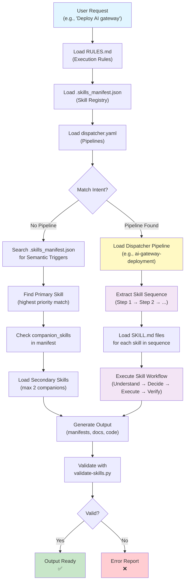

# Skill System Quick-Start

Use this cheat sheet to find the right skill combination for your task, without reading through full documentation.

---

## HOW CLAUDE INVOKES SKILLS

This diagram shows how Claude processes your request and determines which skills to load:



**Key Files in the Flow:**

| File | Purpose | When Loaded |
|------|---------|------------|
| **RULES.md** | Global execution rules & adoption tiers | Always (first) |
| **.skills_manifest.json** | Skill registry with metadata | Always (second) |
| **dispatcher.yaml** | Intent pipelines & sequences | Always (third) |
| **SKILL.md** (individual) | Skill persona, workflow, constraints | When skill activated |
| **validate-skills.py** | Validation automation | Before output |
| **.skills_lookup_index.json** | O(1) keyword lookup (auto-generated) | Optional, for fast search |

**Decision Flow:**

1. **Intent Matching** → Check dispatcher.yaml for pipeline match
2. **Fallback Search** → If no pipeline, grep semantic triggers in manifest
3. **Skill Loading** → Load SKILL.md for activated skill(s)
4. **Composition** → Check manifest for companion skills (max 1 primary + 2 secondary)
5. **Execution** → Run skill workflow (Understand → Decide → Execute → Verify)
6. **Validation** → Run validate-skills.py to catch errors

---

## COMMON WORKFLOWS

### "I want to deploy an AI inference gateway"

**Pipeline:** `ai-gateway-deployment`

**Skills in order:**
1. `k8s-gateway-api` — Design GatewayClass, HTTPRoute, traffic splitting
2. `k8s-gateway-inference` — Configure InferencePool and model routing
3. `nginx-patterns` — Optimize proxy buffering, SSE, upstream retries
4. `k8s-observability-ops` — Add OTEL tracing for inference latency

**Estimated time:** 3-4 hours  
**Output:** Deployable K8s manifests + NGINX config + OTEL instrumentation

---

### "I want to troubleshoot a broken Kubernetes cluster"

**Pipeline:** `cluster-troubleshooting`

**Skills in order:**
1. `k8s-engineer` — Diagnostic queries (logs, events, describe, resource metrics)
2. `platform-engineer` — Infrastructure/node-level root cause analysis
3. `k8s-engineer` + `platform-engineer` — Implement fix + verify
4. `docs-agent` — Write post-mortem documentation

**Estimated time:** 1-3 hours (depends on severity)  
**Output:** Remediation + post-mortem documentation

---

### "I want to write a Product Requirements Document (PRD)"

**Pipeline:** `product-definition`

**Skills in order:**
1. `tech-pm` — Capture strategic intent ("What problem are we solving?")
2. `value-proposition` — Build JTBD value map ("What's the job-to-be-done?")
3. `pm-standards` — Run RICE prioritization ("What's the priority?")
4. `prd-generator` — Write full PRD ("What are the requirements?")
5. `slide-deck-creator` — Generate executive slides ("How do we pitch this?")

**Estimated time:** 2-3 days (depends on scope)  
**Output:** PRD document + executive slide deck

---

### "I want to build an agentic routing proof-of-concept"

**Pipeline:** `agentic-routing-poc`

**Skills in order:**
1. `ai-engineer` — Design agentic logic and decision tree
2. `nginx-patterns` + `k8s-gateway-api` — Implement L7 routing (semantic/header-based)
3. `k8s-observability-ops` — Instrument with GenAI semantic convention tracing
4. `docs-agent` — Write ADR and engineer handoff

**Estimated time:** 2-3 weeks (POC → production handoff)  
**Output:** Working agentic router + ADR + tracing dashboards

---

### "I want to provision a new Kubernetes cluster + GitOps bootstrap"

**Pipeline:** `cluster-lifecycle`

**Skills in order:**
1. `platform-engineer` — Provision cluster (vcluster/k3d/GCP/AWS/Azure)
2. `k8s-engineer` — Bootstrap FluxCD/ArgoCD and sync repositories
3. `k8s-observability-ops` — Install Prometheus/Grafana/OTel baseline

**Estimated time:** 2-4 hours  
**Output:** Production-ready cluster + GitOps pipelines + baseline monitoring

---

### "I want to add security guardrails to my AI model"

**Skills:**
1. `ai-security-patterns` — Audit LLM surface (prompt injection, PII, jailbreaks)
2. `ai-engineer` — Implement guardrails (input filters, output sanitizers)
3. `docs-agent` — Document security model

**No dispatcher pipeline yet** — request one if this becomes a common task  
**Estimated time:** 1-2 weeks (depends on threat model)  
**Output:** Guardrails code + security architecture doc

---

## HOW TO FIND THE RIGHT SKILL

### Quick Method

**Step 1: Describe your task**  
e.g., "I want to optimize NGINX for streaming responses"

**Step 2: Search the manifest**
```bash
# Find matching skills by keyword
grep -i "streaming\|sse\|buffering" ~/.agents/.skills_manifest.json

# Or use the fast lookup index (auto-generated)
python3 << 'EOF'
import json
keyword = "streaming"
with open(f"{Path.home()}/.agents/.skills_lookup_index.json") as f:
    index = json.load(f)
    matches = [skill for skill, triggers in index.items() if any(keyword.lower() in t.lower() for t in triggers)]
    print(f"Matching skills: {matches}")
EOF
```

**Step 3: Check dispatcher pipelines**
```bash
# Look for your use case in dispatcher.yaml
grep -A 10 "intent_pipelines:" ~/.agents/dispatcher.yaml | grep -i "your-keyword"
```

**Step 4: Load the skill**
```
Ask Claude Code: "Use the [skill-name] skill to [your task]"
```

---

## WHEN TO USE DISPATCHER PIPELINES vs. SINGLE SKILLS

### Use a Dispatcher Pipeline When:
- ✅ Task spans multiple domains (e.g., K8s + observability + docs)
- ✅ There's an established workflow (e.g., "deploy AI gateway")
- ✅ You need orchestration (one skill feeds into the next)
- ✅ Your pipeline is in `dispatcher.yaml`

**Examples:** `ai-gateway-deployment`, `cluster-lifecycle`, `product-definition`

### Use Single Skills When:
- ✅ Task is within one domain (e.g., "write K8s manifests")
- ✅ You don't need companion skills
- ✅ Output doesn't feed into another step
- ✅ Quick one-off task

**Examples:** "Use docs-agent to write an ADR", "Use defuddle to clean up this web page"

---

## COMPOSING MULTIPLE SKILLS

If your task spans multiple domains but **doesn't match a dispatcher pipeline**, compose skills manually:

**Example: "I want to build and deploy an AI gateway with security"**

```
ai-engineer (design routing logic)
  ↓
ai-security-patterns (add security checks)
  ↓
k8s-gateway-api (K8s configuration)
  ↓
k8s-gateway-inference (model routing)
  ↓
nginx-patterns (NGINX optimization)
  ↓
k8s-observability-ops (add tracing)
  ↓
docs-agent (document architecture)
```

**Rules:**
- Maximum composition: 1 primary + 2 secondary skills per execution step
- Output from one skill becomes input to the next
- If chain gets longer than 3 steps, consider creating a dispatcher pipeline

---

## SKILL QUICK REFERENCE

### By Domain

#### AI & Machine Learning
- `ai-engineer` — AI PoCs, agentic logic, LangChain, MCP, local LLMs
- `ai-security-patterns` — Prompt injection, PII leakage, jailbreaks, guardrails
- `k8s-ai-expert` — Scaling AI/ML workloads on Kubernetes

#### Kubernetes & Infrastructure
- `platform-engineer` — Cluster provisioning (k3d, kind, GCP, AWS, Azure)
- `k8s-engineer` — Kubernetes networking, troubleshooting, GitOps
- `k8s-gateway-api` — Gateway API design, GatewayClass, HTTPRoute
- `k8s-gateway-inference` — Model routing, InferencePool, InferenceModel
- `k8s-observability-ops` — OpenTelemetry, Prometheus, Grafana, Jaeger

#### Networking & APIs
- `nginx-patterns` — NGINX optimization, SSE, streaming, agentic routing

#### Product Management
- `tech-pm` — PRD writing, feature scoping, roadmap strategy
- `prd-generator` — Generate full PRDs from requirements
- `pm-standards` — JTBD, RICE prioritization, product frameworks
- `value-proposition` — 6-part JTBD value propositions
- `positioning-messaging` — Competitive positioning, launch copy

#### Documentation & Communication
- `docs-agent` — Technical writing, ADRs, design docs
- `slide-deck-creator` — Presentations, slide decks, PowerPoint

#### Knowledge Management
- `obsidian-markdown` — Wikilinks, callouts, markdown frontmatter
- `obsidian-cli` — Search vault, manage notes, reload plugins
- `obsidian-bases` — Create Obsidian Bases, views, formulas
- `json-canvas` — Obsidian Canvas files (.canvas)

#### Utilities
- `defuddle` — Web content extraction, clean markdown
- `find-skills` — Discover which skill to use
- `python-dev-standard` — Python best practices, Pydantic, async

#### Google ADK (Experimental)
- `google-agents-cli-adk-code` — Write agent code
- `google-agents-cli-scaffold` — Create agent templates
- `google-agents-cli-deploy` — Deploy agents
- `google-agents-cli-publish` — Publish to Gemini Enterprise
- `google-agents-cli-eval` — Evaluate agent performance
- `google-agents-cli-observability` — Instrument agents
- `google-agents-cli-workflow` — Build agent workflows

---

## ADOPTION STATUS GUIDE

### Active Skills (Core to Your Practice)
Use these frequently. They're in dispatcher pipelines and actively maintained:

```
ai-engineer, ai-security-patterns,
k8s-gateway-api, k8s-gateway-inference, k8s-observability-ops, k8s-engineer,
nginx-patterns,
docs-agent,
tech-pm, prd-generator, platform-engineer
```

### Maintained Skills (Available but Not Core)
Available for specialized tasks. Lower priority for updates:

```
google-agents-cli-* (7 skills),
obsidian-* (3 skills), json-canvas,
positioning-messaging, slide-deck-creator,
python-dev-standard, value-proposition, pm-standards,
find-skills, defuddle
```

### Deprecated Skills
Marked for removal. Use replacement skill instead:

See `SKILL_MAINTENANCE.md` for current deprecation list and timelines.

---

## WHEN TO CREATE A NEW SKILL

Create a new skill to `~/.agents/skills/` when you have:

- ✅ A **repeatable, domain-specific process** (e.g., "deploying K8s clusters")
- ✅ **Clear entry criteria** (semantic triggers or explicit keywords)
- ✅ **Clear output format** (what does "done" look like?)
- ✅ **Reusable across multiple projects**

**Do NOT create a skill if:**
- ❌ It's a one-off task (just ask Claude directly)
- ❌ It overlaps significantly with existing skills (extend an existing skill instead)
- ❌ You don't have a clear persona/workflow yet

**See:** `IMPLEMENTATION_GUIDE.md` Part 2, Section 2.1 for complete skill addition process.

---

## WHEN TO CREATE A NEW DISPATCHER PIPELINE

Add a new pipeline to `dispatcher.yaml` when you have:

- ✅ A **common multi-skill workflow** you run regularly (e.g., monthly PRD process)
- ✅ **Clear ordering** of skills (A must run before B)
- ✅ **Defined outputs at each step** (what skill 1 produces → what skill 2 consumes)

**Do NOT create a pipeline if:**
- ❌ It's a one-time task
- ❌ Skills can run in any order
- ❌ No clear dependency between steps

**How to create:**
1. Identify the skill sequence
2. Test manually with Claude Code
3. Document in `dispatcher.yaml`:
   ```yaml
   intent_pipelines:
     my-pipeline:
       description: "What this pipeline does"
       sequence:
         - step: 1
           role: YourRole
           skill: skill-1
           output: "What skill 1 produces"
         - step: 2
           role: YourRole
           skill: skill-2
           companion: skill-1
           output: "What skill 2 produces"
   ```
4. Run validation: `python ~/.agents/validate-skills.py --strict`
5. Test the pipeline with Claude Code
6. Commit:
   ```
   feat(pipeline): add my-pipeline for [use case]
   ```

---

## TROUBLESHOOTING

### Problem: Skill not found

```bash
# Check manifest
grep "skill-name" ~/.agents/.skills_manifest.json

# Check skill file exists
ls ~/.agents/skills/skill-name/SKILL.md

# Run validation
python3 ~/.agents/validate-skills.py --strict
```

### Problem: Trigger words not matching

```bash
# Check semantic triggers
grep -C 5 "your-keyword" ~/.agents/.skills_manifest.json

# Verify trigger in SKILL.md
grep -i "your-keyword" ~/.agents/skills/skill-name/SKILL.md
```

### Problem: Dispatcher pipeline broken

```bash
# Validate entire system
python3 ~/.agents/validate-skills.py --strict

# Check dispatcher syntax
python3 -c "import yaml; yaml.safe_load(open('~/.agents/dispatcher.yaml'))"

# List all pipelines
grep "intent_pipelines:" ~/.agents/dispatcher.yaml -A 1
```

### Problem: Can't compose skills

If you need multiple skills and no dispatcher pipeline exists:
1. Check `USAGE.md` (this file) — maybe a pipeline already covers it
2. Test manual composition with Claude Code
3. If it becomes a regular workflow, create a dispatcher pipeline
4. Ask Claude Code to "use the find-skills skill to help me find the right skills"

---

## QUICK REFERENCE: DISPATCHER PIPELINES

| Pipeline | When to Use | Time | Output |
|----------|-----------|------|--------|
| `ai-gateway-deployment` | Deploy inference gateway | 3-4 hrs | K8s + NGINX + tracing |
| `cluster-troubleshooting` | Fix cluster issues | 1-3 hrs | Remediation + post-mortem |
| `cluster-lifecycle` | Provision new cluster | 2-4 hrs | Cluster + GitOps + monitoring |
| `agentic-routing-poc` | Build agentic router | 2-3 wks | Router + ADR + tracing |
| `product-definition` | Write PRD | 2-3 days | PRD + slides |

---

## NEXT STEPS

1. **Bookmark this file:** `~/.agents/USAGE.md`
2. **For new task:** Check "COMMON WORKFLOWS" section first
3. **For task not listed:** Use "HOW TO FIND THE RIGHT SKILL" section
4. **For new skill:** See `IMPLEMENTATION_GUIDE.md` Part 2
5. **For versions/deprecation:** See `SKILL_MAINTENANCE.md`
6. **For validation:** Run `python3 ~/.agents/validate-skills.py`

---

## REFERENCES

- [[IMPLEMENTATION_GUIDE.md]] — Complete skill system guide (Parts 1, 2, 3)
- [[SKILL_MAINTENANCE.md]] — Versioning, deprecation, quarterly audits
- [[dispatcher.yaml]] — All dispatcher pipelines
- [[RULES.md]] — Global execution rules
- [.skills_manifest.json](.skills_manifest.json) — Skill registry (raw)
- [.skills_lookup_index.json](.skills_lookup_index.json) — Fast keyword index
