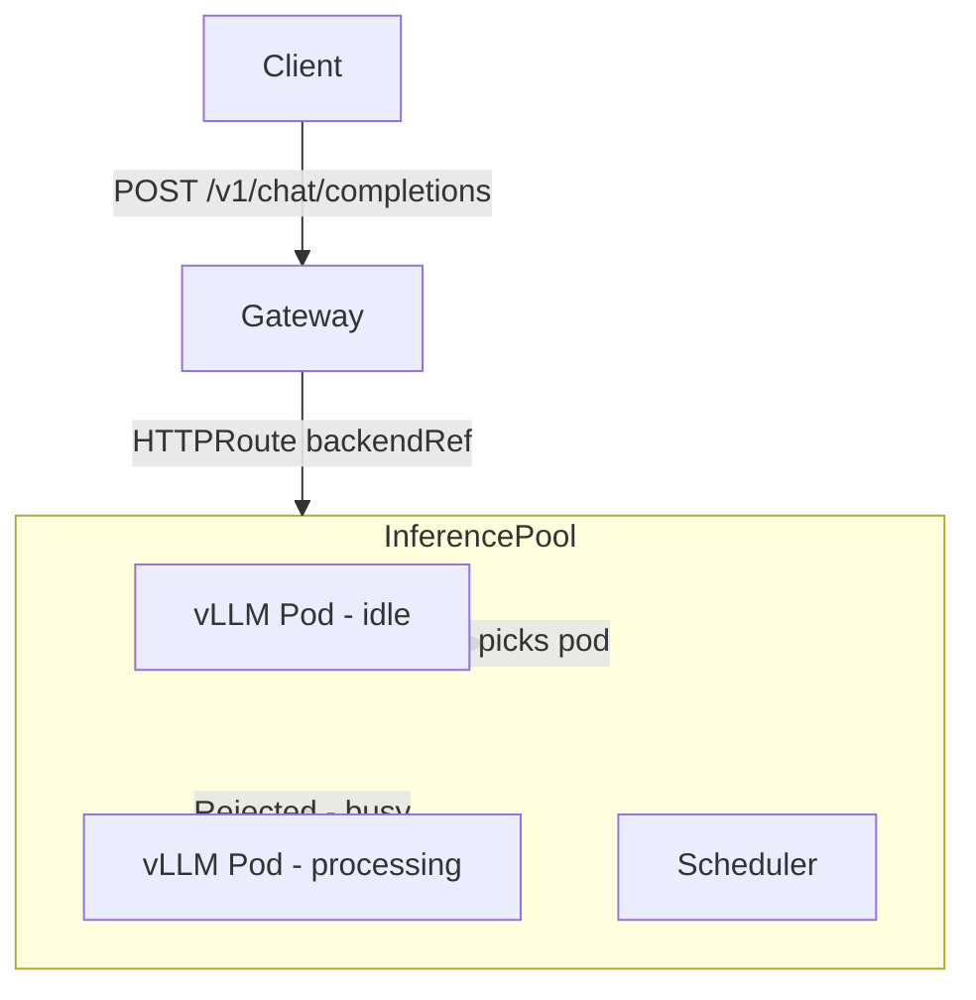

# Kubernetes Gateway Inference Extensions — Deep Reference

## What Is It?

Gateway Inference Extensions (GIE) is a Kubernetes-native layer for routing AI inference traffic intelligently across model-serving pods. 
It extends the Gateway API with two new CRDs:

- **InferencePool** — A group of model-serving instances (pods) with a shared scheduler
- **InferenceModel** — A named model with routing priority and criticality settings, backed by an InferencePool

The key insight: standard HTTPRoute load-balances by round-robin. That's bad for inference — a pod mid-processing a 10,000-token request shouldn't get another request. GIE's scheduler picks pods based on real-time signals: queue depth, KV cache utilization, prefix cache hit rate.

**Status**: KEP-4726, evolving quickly. CRD versions are alpha. Always check the release notes of the controller you're using.

---

## Architecture



The GIE scheduler runs as a sidecar or extension server alongside the Gateway controller. It intercepts requests bound for an InferencePool and selects the optimal backend pod before the Gateway forwards the request.

---

## CRD Reference

### InferencePool

```yaml
apiVersion: inference.networking.x-k8s.io/v1alpha2
kind: InferencePool
metadata:
  name: llama3-pool
  namespace: inference
spec:
  targetPortNumber: 8000    # port your model server listens on
  selector:
    matchLabels:
      app: vllm-llama3      # selects which pods are in this pool
  extensionRef:             # points to the GIE scheduler server
    name: inference-extension-server
```

### InferenceModel

```yaml
apiVersion: inference.networking.x-k8s.io/v1alpha2
kind: InferenceModel
metadata:
  name: llama3-8b
  namespace: inference
spec:
  modelName: meta-llama/Meta-Llama-3-8B-Instruct  # model ID as requested by client
  criticality: Standard   # Standard | Sheddable
  poolRef:
    name: llama3-pool
```

**criticality values:**
- `Critical` — Never shed this request (e.g., production SLA)
- `Standard` — Normal handling
- `Sheddable` — Drop under high load (e.g., batch/background jobs)

### HTTPRoute pointing to InferencePool

```yaml
apiVersion: gateway.networking.k8s.io/v1
kind: HTTPRoute
metadata:
  name: inference-route
  namespace: inference
spec:
  parentRefs:
    - name: demo-gateway
      namespace: gateway
  rules:
    - matches:
        - path:
            type: PathPrefix
            value: /v1
      backendRefs:
        - group: inference.networking.x-k8s.io
          kind: InferencePool
          name: llama3-pool
          port: 8000
```

Note the `group` and `kind` on the backendRef — this is how HTTPRoute targets an InferencePool instead of a Service.

---

## Multi-Model Routing Pattern

Route different models to different pools using header matching:

```yaml
apiVersion: gateway.networking.k8s.io/v1
kind: HTTPRoute
metadata:
  name: model-router
  namespace: inference
spec:
  parentRefs:
    - name: demo-gateway
      namespace: gateway
  rules:
    # Route based on model field — requires GIE to extract it
    - matches:
        - headers:
            - name: x-model-id
              value: llama3-8b
      backendRefs:
        - group: inference.networking.x-k8s.io
          kind: InferencePool
          name: llama3-pool
          port: 8000
    - matches:
        - headers:
            - name: x-model-id
              value: mistral-7b
      backendRefs:
        - group: inference.networking.x-k8s.io
          kind: InferencePool
          name: mistral-pool
          port: 8000
```

In practice, clients send the model in the JSON body (`{"model": "llama3-8b", ...}`). GIE can extract body fields and map them to routing headers. Check the specific controller's docs for body-based routing support.

---

## vLLM Deployment for GIE

```yaml
apiVersion: apps/v1
kind: Deployment
metadata:
  name: vllm-llama3
  namespace: inference
spec:
  replicas: 2
  selector:
    matchLabels:
      app: vllm-llama3
  template:
    metadata:
      labels:
        app: vllm-llama3
    spec:
      containers:
        - name: vllm
          image: vllm/vllm-openai:latest
          args:
            - --model
            - meta-llama/Meta-Llama-3-8B-Instruct
            - --served-model-name
            - llama3-8b
            - --port
            - "8000"
          ports:
            - containerPort: 8000
          resources:
            limits:
              nvidia.com/gpu: "1"
              memory: 24Gi
            requests:
              nvidia.com/gpu: "1"
              memory: 20Gi
          env:
            - name: HUGGING_FACE_HUB_TOKEN
              valueFrom:
                secretKeyRef:
                  name: hf-token
                  key: token
          readinessProbe:
            httpGet:
              path: /health
              port: 8000
            initialDelaySeconds: 60  # model loading takes time
            periodSeconds: 10
          livenessProbe:
            httpGet:
              path: /health
              port: 8000
            initialDelaySeconds: 120
            failureThreshold: 3
      tolerations:
        - key: nvidia.com/gpu
          operator: Exists
          effect: NoSchedule
      nodeSelector:
        accelerator: nvidia-gpu   # adjust to your node labels
```

---

## TGI (Text Generation Inference) Deployment

```yaml
apiVersion: apps/v1
kind: Deployment
metadata:
  name: tgi-mistral
  namespace: inference
spec:
  replicas: 1
  selector:
    matchLabels:
      app: tgi-mistral
  template:
    metadata:
      labels:
        app: tgi-mistral
    spec:
      containers:
        - name: tgi
          image: ghcr.io/huggingface/text-generation-inference:latest
          args:
            - --model-id
            - mistralai/Mistral-7B-Instruct-v0.2
            - --port
            - "8080"
            - --num-shard
            - "1"
          ports:
            - containerPort: 8080   # HTTP (OpenAI-compatible)
            - containerPort: 8033   # gRPC
          resources:
            limits:
              nvidia.com/gpu: "1"
          env:
            - name: HUGGING_FACE_HUB_TOKEN
              valueFrom:
                secretKeyRef:
                  name: hf-token
                  key: token
```

---

## Without GPUs — CPU Inference for POCs

For local k3d demos without GPUs, use quantized models:

```yaml
# Use llama.cpp HTTP server or Ollama
containers:
  - name: ollama
    image: ollama/ollama:latest
    ports:
      - containerPort: 11434
    resources:
      limits:
        memory: 8Gi
      requests:
        memory: 4Gi
    # No GPU — runs on CPU (slow but works for demos)
```

Ollama exposes an OpenAI-compatible API at `/v1/chat/completions`. Use it as a drop-in for vLLM in POCs.

---

## GIE Installation

The GIE project provides a reference implementation. Install CRDs first, then the scheduler extension:

```bash
# Install Gateway API CRDs (standard)
kubectl apply -f https://github.com/kubernetes-sigs/gateway-api/releases/latest/download/standard-install.yaml

# Install GIE CRDs
kubectl apply -f https://github.com/kubernetes-sigs/gateway-api-inference-extension/releases/latest/download/install.yaml
```

Via Flux HelmRelease (check for current chart):
```yaml
apiVersion: source.toolkit.fluxcd.io/v1
kind: HelmRepository
metadata:
  name: gateway-api-inference
  namespace: flux-system
spec:
  interval: 1h
  url: https://kubernetes-sigs.github.io/gateway-api-inference-extension
```

---

## Observability

vLLM exposes Prometheus metrics at `:8000/metrics`:
- `vllm:gpu_cache_usage_perc` — KV cache utilization
- `vllm:num_requests_running` — Active requests
- `vllm:num_requests_waiting` — Queue depth
- `vllm:e2e_request_latency_seconds` — End-to-end latency histogram

Wire up a ServiceMonitor for each pool:
```yaml
apiVersion: monitoring.coreos.com/v1
kind: ServiceMonitor
metadata:
  name: vllm-llama3
  namespace: monitoring
spec:
  selector:
    matchLabels:
      app: vllm-llama3
  namespaceSelector:
    matchNames:
      - inference
  endpoints:
    - port: http
      path: /metrics
      interval: 15s
```

---

## Common Issues

| Symptom | Cause | Fix |
|---------|-------|-----|
| Pod stuck in Pending | No GPU nodes, or taint not tolerated | Check `kubectl describe pod`, add tolerations |
| Model loading timeout | Large model, slow disk | Increase `initialDelaySeconds` on readinessProbe |
| 503 from Gateway | Pool has no ready pods | Check pod readiness, HF token valid |
| OOM kill | `memory.limits` too low | Increase, or use quantized model |
| GIE scheduler not picking pods | Selector mismatch | `InferencePool.spec.selector` must match pod labels |

---

## Strategic Design Patterns

### Criticality Tiers
Map your product SLAs to criticality levels to handle automated request preemption under load:

| Level | Behavior | Use Case |
|---|---|---|
| `Critical` | Never preempted. Always queued/served. | Production customer-facing LLM calls |
| `Standard` | Queued normally. May wait during bursts. | Internal tools, batch summarization |
| `Sheddable` | Dropped first under high load (503). | Background jobs, low-priority evals |

### LoRA Adapter Routing
`InferenceModel` supports routing to specific LoRA adapters loaded on vLLM pods. The endpoint picker ensures the request lands on a pod that actually has the adapter in memory.

**vLLM LoRA Config:**
```bash
vllm serve meta-llama/Llama-3-8B-Instruct \
  --enable-lora \
  --lora-modules \
    finance-adapter=/models/lora/finance \
    code-adapter=/models/lora/code
```

### Prefix Cache Awareness
The GIE scheduler (endpoint picker) can route requests to pods with warm KV caches for specific prefixes (e.g., long system prompts), drastically reducing Time-to-First-Token (TTFT).

### F5 XC Integration Architecture
Reference end-to-end architecture for multi-cloud AI delivery:
1. **F5 XC Regional Edge**: WAF, Bot protection, and Global Rate Limiting (Token-aware).
2. **F5 XC Customer Edge**: Deployed on K8s cluster to provide secure ingress.
3. **K8s Gateway API**: NGINX Gateway Fabric or Envoy Gateway.
4. **Gateway Inference Extension**: `InferencePool` + `InferenceModel` for smart model routing.
5. **vLLM Backends**: GPU-accelerated model servers.

---

## Inference POC Ideas

| ID | POC | Value |
|---|---|---|
| K8S-INF-001 | **Hello InferencePool** — basic model serving via Gateway API | Foundational |
| K8S-INF-002 | **LoRA Routing** — multiple adapters with weighted routing | Strategic |
| K8S-INF-003 | **Prefix Cache awareness** — measuring TTFT latency reduction | Performance |
| K8S-INF-004 | **XC → Gateway → InferencePool** — end-to-end multi-cloud arch | Reference |
| K8S-INF-005 | **KEDA Autoscaling** — scaling pools based on GIE queue depth | Operational |
